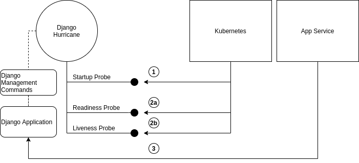

User's guide
============

Introduction
------------
Hurricane is an initiative to fit `Django <https://www.djangoproject.com/>`_ perfectly with
`Kubernetes <https://kubernetes.io/>`_. It is supposed to cover many capabilities in order to run Django in a
cloud-native environment, including a `Tornado <https://www.tornadoweb.org/>`_-powered Django application server. It
was initially created by `Blueshoe GmbH <https://www.blueshoe.de/>`_.

Django was developed with the batteries included-approach and already handles most of the challenges around web
development with grace. It was initially developed at a time when web applications got deployed and run on a server
(physical or virtual). With its pragmatic design it enabled many developers to keep up with changing requirements,
performance and maintenance work. However, service architectures have become quite popular for complex applications
in the past few years. They provide a modular style based on the philosophy of dividing overwhelming software projects
into smaller and more controllable parts. The advantage of highly specialized applications gained prominence among
developers, but introduces new challenges to the IT-operation. However, with the advent of Kubernetes and the
cloud-native development philosophy a couple of new possibilities emerged to run those service-based applications even
better. Kubernetes is a wonderful answer for just as many IT-operation requirements as Django is for web development.
The inherent monolithic design of Django can be tempting to roll out recurring operation patterns with each application.
It's not about getting Django to run in a Kubernetes cluster (you may already solved this), it's about integrating
Django as tightly as possible with Kubernetes in order to harness the full power of that platform. Creating the most
robust, scalable and secure applications with Django by leveraging the existing expertise of our favorite framework is
the main goal of this initiative.

Using Tornado-powered application server gives several advantages compared to the standard Django application server.
It is single-threaded and at the same time non-blocking and includes a builtin IO Loop from
`asyncio <https://docs.python.org/3/library/asyncio.html>`_ library. Django application server is blocked while waiting
for the client. On the other hand Tornado application server can handle processes asynchronously and thus is not blocked
while waiting for the client or database. This also gives the possibility to run webhooks and other asynchronous tasks
directly in the application server, avoiding the usage of external asynchronous task queues such as Celery.

Application Server
------------------

**Run the application server**

In order to start the Django app run the management command *serve*:
::
   python manage.py serve

It simply starts a Tornado-based application server ready to serve your Django application. No need for any other
app server.

Command options for *serve*-command:

+--------------------+-------------------------------------------------------------------------------------+
| **Option**         | **Description**                                                                     |
+--------------------+-------------------------------------------------------------------------------------+
| --static           | Serve collected static files                                                        |
+--------------------+-------------------------------------------------------------------------------------+
| --media            | Serve media files                                                                   |
+--------------------+-------------------------------------------------------------------------------------+
| --autoreload       | Reload code on change                                                               |
+--------------------+-------------------------------------------------------------------------------------+
| --debug            | Set Tornado's Debug flag (don't confuse with Django's DEBUG=True)                   |
+--------------------+-------------------------------------------------------------------------------------+
| --port             | The port for Tornado to listen on (default is port 8000)                            |
+--------------------+-------------------------------------------------------------------------------------+
| --startup-probe    | The exposed path (default is /startup) for probes to check startup                  |
+--------------------+-------------------------------------------------------------------------------------+
| --readiness-probe  | The exposed path (default is /ready) for probes to check readiness                  |
+--------------------+-------------------------------------------------------------------------------------+
| --liveness-probe   | The exposed path (default is /alive) for probes to check liveness                   |
+--------------------+-------------------------------------------------------------------------------------+
| --probe-port       | The port for Tornado probe routes to listen on (default is the next port of --port) |
+--------------------+-------------------------------------------------------------------------------------+
| --req-queue-len    | Threshold of length of queue of request, which is considered for readiness probe    |
+--------------------+-------------------------------------------------------------------------------------+
| --no-probe         | Disable probe endpoint                                                              |
+--------------------+-------------------------------------------------------------------------------------+
| --no-metrics       | Disable metrics collection                                                          |
+--------------------+-------------------------------------------------------------------------------------+
| --command          | Repetitive command for adding execution of management commands before serving       |
+--------------------+-------------------------------------------------------------------------------------+
| --webhook-url      | If specified, webhooks will be sent to this url                                     |
+--------------------+-------------------------------------------------------------------------------------+

**Probes and the System Check Framework**

The probe endpoint invokes `Django system check framework <https://docs.djangoproject.com/en/2.2/topics/checks/>`_.
This endpoint is called in a certain interval by Kubernetes, hence we get regular checks on the application. That's
a well-suited approach to integrate custom checks (please refer to the Django documentation how to do that) and get
health and sanity checks for free. Upon unhealthy declared applications (error-level) Kubernetes will restart the
application and remove unhealthy PODs once a new instance is in healthy state.
The port for the probe route is separated from the application's port. If not specified, the probe port is one port
added to the application's port. For more information on this topic on Kubernetes side, please refer to
`Configure Liveness, Readiness and Startup Probes <https://kubernetes.io/docs/tasks/configure-pod-container/configure-liveness-readiness-startup-probes/>`_.

**Management commands**
Management commands can be added as options for hurricane serve command. Kubernetes is be able to poll startup probe
and if management commands are still running, it knows, that it should not restart the container yet. Management
commands can be given as repeating arguments to the serve management command e.g.:
::
    python manage.py serve --command makemigrations --command migrate

If you want to add some options to the specific management command take both this command and it's options in the
quotation marks:
::
    python manage.py serve --command "compilemessages --no-color"

**Important:** management commands should be given in the order, which is required for django application. Each
management command is then executed sequentially. Commands, which depend on other commands should be given after
the commands they depend on. E.g. management_command_2 is depending on management_command_1, thus the serve command
should look like this:
::
    python manage.py serve --command management_command_1 --command management_command_2

**Endpoints**

Probe server creates handlers for three endpoints: startup, readiness and liveness.

where **1** is a Kubernetes startup probe, it returns a response with a status 400, if the application has not started
yet or/and management commands are not finished yet. After finishing management commands and starting HTTP Server this
endpoint will return a response of status 200 and from that point, Kubernetes will know, that the application was
started, so readiness and liveness probes can be polled.
**2a** and **2b** are readiness and liveness probes respectively. Kubernetes will poll these probes, only after the
startup probe returns 200 for the first time. The readiness probe checks the length of the request queue, if it
is larger than the threshold, it returns 400, which means, that application is not ready for further requests.
The liveness probe uses Django system check framework to identify problems with the Django application.
**3** are api requests, sent by the application service, which are then handled in Django application.

Probe server, which defines handlers for every probe endpoint, runs in the main loop. Execution of management
commands does not block the main event loop and thus runs in a separate executor. Upon successful execution
of management commands, the HTTP server is started.

**Webhooks**

Webhooks can be specified as command options of *serve*-command. Right now, there are available two webhooks: startup-
webhook and liveness-webhook. First is an indicator of the status of startup probe. Startup-webhook sends a status, and
depending on success or failure of startup process it can send either positive or negative status. Liveness-webhook is
triggered, when liveness-webhook url is specified and the liveness-probe is requested and the change of the health
state is detected. For instance, if liveness probe is requested, but there was no change of the health variable, no
webhook will be sent. Similarly, readiness webhook is sent upon the change of it's state variable.
Webhooks run as asynchronous processes and thus do not block the asyncio-loop. If the specified url is wrong or it
cannot handle webhook properly, an error or a warning will be logged. Response of the webhook should
be 200 to indicate the success of receiving webhook.

*Creating new webhook types*
The new webhook types can be specified in an easy manner in the hurricane/webhooks/webhook_types.py file. They need to
specify Webhook class as a parent class. After creating a new webhook class, you can specify a new argument of the
management command to parametrize the url, to which webhook will be sent. Then, you can just create an object of webhook
and run it at the place in code, where it should be executed. Run method should have several methods i.e. url (to which
webhook should be sent) and status (webhook on success or failure).

**Settings**
`HURRICANE_VERSION` - is sent together with webhooks to distinguish between different versions.

**Logging**

It should be ensured, that the *hurricane* logger is added to Django logging configuration, otherwise log outputs will
not be displayed when application server will be started.

AMQP Worker
-----------

**Run the AMQP (0-9-1) Consumer**

In order to start the Django-powered AMQP consumer following *consume*-command can be used:
::
    python manage.py consume HANLDER

This command starts a `Pika-based <https://pika.readthedocs.io/en/stable/>`_ amqp consumer which is observed by
Kubernetes. The required *Handler* argument is the dotted path to an *_AMQPConsumer* implementation. Please use
the *TopicHandler* as base class for your handler implementation as it is the only supported exchange type at the moment.
It's primarily required to implement the *on_message(...)* method to handle incoming amqp messages.

In order to establish a connection to the broker you case use one of the following options:
Load from *Django Settings* or *environment variables*:

+----------------+-------------------------------------------------------------------------------------+
| **Variable**   | **Help**                                                                            |
+----------------+-------------------------------------------------------------------------------------+
| AMQP_HOST      | amqp broker host                                                                    |
+----------------+-------------------------------------------------------------------------------------+
| AMQP_PORT      | amqp broker port                                                                    |
+----------------+-------------------------------------------------------------------------------------+
| AMQP_VHOST     | virtual host (defaults to "/")                                                      |
+----------------+-------------------------------------------------------------------------------------+
| AMQP_USER      | username for broker connection                                                      |
+----------------+-------------------------------------------------------------------------------------+
| AMQP_PASSWORD  | password for broker connection                                                      |
+----------------+-------------------------------------------------------------------------------------+

The precedence is: 1. command line option (if available), 2. Django settings, 3. environment variable

Command options for *consume*-command:

+------------------+-------------------------------------------------------------------------------------+
| **Option**       | **Description**                                                                     |
+------------------+-------------------------------------------------------------------------------------+
| --queue          | The queue name this consumer declares and binds to                                  |
+------------------+-------------------------------------------------------------------------------------+
| --exchange       | The exchange name this consumer declares                                            |
+------------------+-------------------------------------------------------------------------------------+
| --amqp-port      | The broker service port                                                             |
+------------------+-------------------------------------------------------------------------------------+
| --amqp-host      | The broker host name in the cluster                                                 |
+------------------+-------------------------------------------------------------------------------------+
| --amqp-vhost     | The consumer's virtual host to use                                                  |
+------------------+-------------------------------------------------------------------------------------+
| --handler        | the Hurricane AMQP handler class (dotted path)                                      |
+------------------+-------------------------------------------------------------------------------------+
| --startup-probe  | The exposed path (default is /startup) for probes to check startup                  |
+------------------+-------------------------------------------------------------------------------------+
| --readiness-probe| The exposed path (default is /ready) for probes to check readiness                  |
+------------------+-------------------------------------------------------------------------------------+
| --liveness-probe | The exposed path (default is /alive) for probes to check liveness                   |
+------------------+-------------------------------------------------------------------------------------+
| --probe-port     | The port for Tornado probe routes to listen on (default is the next port of --port) |
+------------------+-------------------------------------------------------------------------------------+
| --req-queue-len  | Threshold of length of queue of request, which is considered for readiness probe    |
+------------------+-------------------------------------------------------------------------------------+
| --no-probe       | Disable probe endpoint                                                              |
+------------------+-------------------------------------------------------------------------------------+
| --no-metrics     | Disable metrics collection                                                          |
+------------------+-------------------------------------------------------------------------------------+
| --autoreload     | Reload code on change                                                               |
+------------------+-------------------------------------------------------------------------------------+
| --debug          | Set Tornado's Debug flag (don't confuse with Django's DEBUG=True)                   |
+------------------+-------------------------------------------------------------------------------------+
| --reconnect      | Reconnect the consumer if the broker connection is lost (not recommended)           |
+------------------+-------------------------------------------------------------------------------------+

**Example AMQP Consumer**

Implementation of a basic AMQP handler with no functionality:

.. code-block:: python
   :emphasize-lines: 3,5

   # file: myamqp/consumer.py
   from hurricane.amqp.basehandler import TopicHandler

   class MyTestHandler(TopicHandler):
        def on_message(self, _unused_channel, basic_deliver, properties, body):
             print(body.decode("utf-8"))
             self.acknowledge_message(basic_deliver.delivery_tag)

This handler can be started using the following command:
::
    python manage.py consume myamqp.consumer.MyTestHandler --queue my.test.topic --exchange test --amqp-host 127.0.0.1 --amqp-port 5672

**Test Hurricane**

In order to run the entire test suite following commands should be executed:
::
   shell
   pip install -r requirements.txt
   coverage run manage.py test
   coverage combine
   coverage report

**Important:** the AMQP testcase requires *Docker* to be accessible from the current user as it
spins up a container with *RabbitMQ*. The AMQP consumer in a test mode will connect to
it and exchange messages using the *TestPublisher* class.
